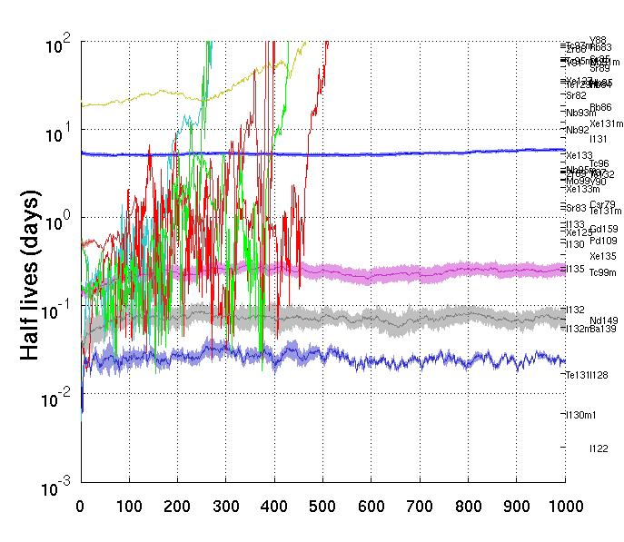

# MATLAB scripts for "A Bayesian Analysis of the Radioactive Releases of Fukushima" (AISTATS 2012)

## Instructions
1. Start MATLAB
1. Set opengl to software (avoids unexpected MATLAB crash)

 ```matlab
 opengl software;
 ```
1. Run the experiment

 ```matlab
 s_infer_fukushima1;
 ```

## Results


Horizontal axis: dates. Vertical axis: dose rate in µSV/h.



Horizontal axis: number of iterations. Area around each curve: confidence of the model (or strength of the support from data in the Bayesian sense) that a nuclide with the corresponding decay constant existed.

## Reference
 * R. Tomioka & M. Mørup (2012) [A Bayesian Analysis of the Radioactive Releases of Fukushima
](http://jmlr.org/proceedings/papers/v22/tomioka12/tomioka12.pdf). In Proc. AI & Stats. 2012, La Palma, Spain.
